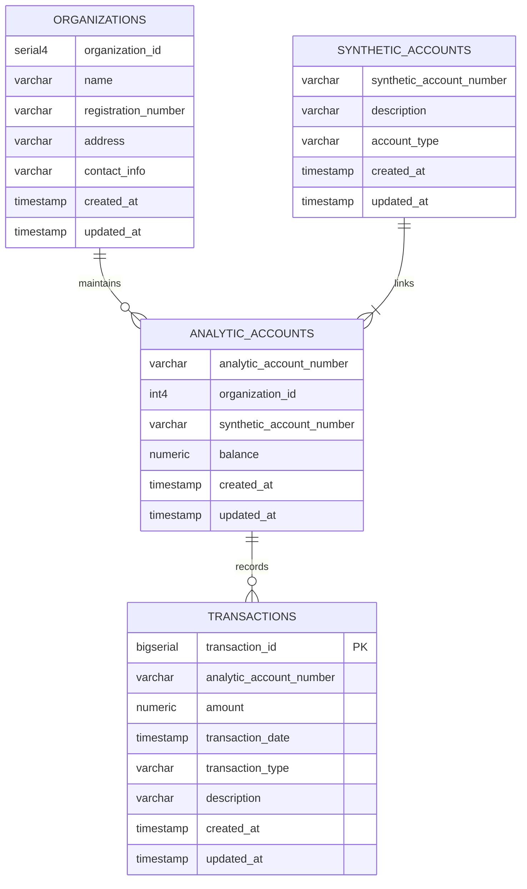

# Разработчик DWH (Открытая школа Т1)

## Сквозной проект №2


<details>
<summary>🔷🔷🔷 Задание 1 - 30.09 🔷🔷🔷</summary>

<details>
<summary>Практическое задание</summary>

  

  | Архитектурный подход | Плюсы                                             | Минусы                                           | Критерии для выбора                             |
|----------------------|--------------------------------------------------|-------------------------------------------------|-------------------------------------------------|
| **DWH** | - Высокая производительность запросов <br> - Структурированные данные <br> - Поддержка аналитики и отчетности | - Высокие затраты на хранение <br> - Длительная настройка <br> - Жесткие схемы | - Нужен централизованный доступ к структурированным данным <br> - Сложные аналитические запросы |
| **Data Lake**        | - Гибкость в хранении как структурированных, так и неструктурированных данных <br> - Низкая стоимость хранения | - Управление качеством данных сложно <br> - Потенциальные проблемы с безопасностью <br> - Меньше оптимизации для аналитики | - Большие объемы неструктурированных данных <br> - Необходимость в быстром доступе к данным |
| **Lake House**       | - Комбинация подходов Data Lake и DWH <br> - Поддержка как аналитических, так и транзакционных запросов <br> - Упрощенное управление данными | - Сложность в реализации <br> - Высокие требования к ресурсам | - Нужен баланс между структурированными и неструктурированными данными <br> - Необходимость в гибком хранилище |
| **Data Mesh**        | - Децентрализация данных <br> - Командная ответственность за данные <br> - Легче интегрировать с микросервисной архитектурой | - Требует изменения культуры работы с данными <br> - Сложность в обеспечении согласованности данных | - Необходимость гибкости и быстрой адаптации <br> - Уровень зрелости команды и инфраструктуры |

</details>

<details>
<summary>Сквозное задание</summary>


## Тип хранилища
Поскольку необходимо реализовать локальное хранилище для аналитических и балансовых счетов, которое будет обновляться несколько раз в день, оптимальным выбором является операционное хранилище данных (ODS). Оно позволяет интегрировать данные из разных источников и обрабатывать их в реальном времени, что соответствует требованиям по частому обновлению информации.
## Количество слоев
Для данной задачи подойдет архитектура с тремя слоями:

- Первый слой (Staging/Storage Layer): Здесь данные собираются, обрабатываются и нормализуются. Это служит для глубокого анализа и долгосрочного хранения.
- Второй слой (Presentation Layer): На этом уровне создаются бизнес-витрины данных с агрегированными показателями для пользователей.

Такое разделение слоев позволяет эффективно управлять, хранить и предоставлять доступ к данным, соответствуя современным требованиям к организациям хранилищ данных. 
</details>
</details>

<details>
<summary>🔷🔷🔷 Задание 2 - 03.10 🔷🔷🔷</summary>

  <details>
<summary>Практическое задание</summary>


### Таблицы в схеме arenadata_toolkit

| Наименование          | Содержание                                                                                                          | Применение                                                  |
|-----------------------|---------------------------------------------------------------------------------------------------------------------|-------------------------------------------------------------|
| `daily_operation`     | Информация об автоматических операциях VACUUM и ANALYZE, проводимых над таблицами базы данных по расписанию  | Анализ и оптимизация процесса хранения данных, обеспечивая регулярное обслуживание таблиц |
| `db_files_current`    | Текущая информация о файлах базы данных на всех сегментах кластера, связываемая с таблицами, индексами и другими объектами базы данных, актуальная на момент последнего запуска скрипта collect_table_stats | Помогает в мониторинге и отладке системы, предоставляя актуальные данные о файловой структуре БД  |
| `db_files_history`    | Хранит историю изменений файлов БД на всех сегментах кластера с привязкой к таблицам, индексам и другим объектам БД (при возможности определения таких связей) |  Наблюдение за изменением использования дискового пространства во времени, что важно для анализа роста и распределения данных   |
| `operation_exclude`   | Информация о схемах базы данных, к которым не применяются операции VACUUM и ANALYZE при запуске соответствующих скриптов | Управление и мониторинг использования ресурсов, позволяя исключать ненужные операции для определённых схем |


### Представлений в arenadata_toolkit не найдено!!!

### Представления в схеме gp_toolkit

| Наименование                             | Содержимое                                                             | Применение                                                  |
|------------------------------------------|------------------------------------------------------------------------|-------------------------------------------------------------|
| `_gp_fullname`                           | Полные имена объектов базы данных                                      | Используется для ссылки на объекты с полными именами        |
| `_gp_is_append_only`                     | Проверка, является ли таблица дополнением только                       | Для оптимизации вставки данных                              |
| `_gp_number_of_segments`                 | Сегментарная информация таблиц                                         | Для анализа распределения данных                            |
| `_gp_user_data_tables`                   | Информация о пользовательских таблицах                                 | Управление и учет пользовательских данных                   |
| `_gp_user_data_tables_readable`          | Читаемые пользовательские таблицы                                      | Для анализа читаемых таблиц                                 |
| `_gp_user_namespaces`                    | Пространства имен пользователей                                        | Для управления пространствами имен                          |
| `_gp_user_tables`                        | Таблицы пользователей                                                  | Учет пользовательских таблиц                                |
| `gp_bloat_diag`                          | Диагностика раздувания таблиц                                          | Анализ и оптимизация хранения данных                        |
| `gp_bloat_expected_pages`                | Ожидаемые страницы раздувания                                          | Для выявления возможного раздувания                         |
| `gp_locks_on_relation`                   | Блокировки на отношениях                                               | Управление блокировками и конкурентным доступом             |
| `gp_locks_on_resqueue`                   | Блокировки на очередях ресурсов                                        | Мониторинг использования ресурсов                           |
| `gp_log_command_timings`                 | Временные метки выполнения команд                                      | Анализ производительности команд                            |
| `gp_log_database`                        | Логи базы данных                                                       | Общий мониторинг и отладка системы                          |
| `gp_log_master_concise`                  | Краткие логи от мастера                                                | Быстрая диагностика проблем                                 |
| `gp_log_system`                          | Системные логи                                                         | Помогает в отладке и мониторинге системы                    |
| `gp_param_settings_seg_value_diffs`      | Различия в параметрах сегментов                                        | Анализ конфигурации сегментов                               |
| `gp_pgdatabase_invalid`                  | Неверные записи в базе данных                                          | Обнаружение и исправление аномалий                          |
| `gp_resgroup_config`                     | Конфигурация групп ресурсов                                            | Управление ресурсными группами                              |
| `gp_resgroup_status`                     | Статус групп ресурсов                                                  | Мониторинг использования ресурсов                           |
| `gp_resgroup_status_per_host`            | Статус групп ресурсов по хостам                                        | Детальный мониторинг по хостам                              |
| `gp_resgroup_status_per_segment`         | Статус групп ресурсов по сегментам                                     | Детальный мониторинг по сегментам                           |
| `gp_resq_activity`                       | Активность очередей ресурсов                                           | Управление и мониторинг использования ресурсов              |
| `gp_resq_activity_by_queue`              | Активность распределена по очередям                                    | Анализ различных очередей                                   |
| `gp_resq_priority_backend`               | Приоритеты бекенда                                                     | Оптимизация использования бекенд ресурсов                   |
| `gp_resq_priority_statement`             | Приоритеты заявлений                                                   | Оптимизация выполнения заявлений                            |
| `gp_role`                                | Информация о ролях                                                     | Управление и контроль доступа                               |
| `gp_resqueue_status`                     | Статус очередей ресурсов                                               | Мониторинг и оптимизация использования ресурсов             |
| `gp_roles_assigned`                      | Назначенные роли в системе                                             | Управление и контроль ролей пользователей                   |
| `gp_size_of_all_table_indexes`           | Общий размер индексов всех таблиц                                      | Анализ потребления пространства индексами                   |
| `gp_size_of_database`                    | Размер базы данных                                                     | Наблюдение за использованием дискового пространства         |
| `gp_size_of_index`                       | Размер конкретного индекса                                             | Оптимизация дизайна индексов                                |
| `gp_size_of_partition_and_indexes_disk`  | Размер разделов и индексов на диске                                    | Управление дисковым пространством                           |
| `gp_size_of_schema_disk`                 | Размер схем на диске                                                   | Оптимизация использования схем                              |
| `gp_size_of_table_and_indexes_disk`      | Размер таблиц и их индексов на диске                                   | Полный учет потребления пространства                        |
| `gp_size_of_table_and_indexes_licensing` | Лицензионная информация о размере таблиц и индексов                    | Анализ соответствия лицензии использования ресурсов         |
| `gp_size_of_table_disk`                  | Размер таблицы на диске                                                | Оптимизация хранения данных                                 |
| `gp_size_of_table_uncompressed`          | Неражатый размер таблицы                                               | Анализ эффективности сжатия данных                          |
| `gp_skew_coefficients`                   | Коэффициенты неравномерности распределения данных                      | Анализ и оптимизация распределения данных на сегментах      |
| `gp_skew_idle_fractions`                 | Пропорции простаивания при несбалансированности                        | Оптимизация производительности                              |
| `gp_stats_missing`                       | Отсутствующие статистические данные                                    | Выявление и исправление статистических аномалий             |
| `gp_table_indexes`                       | Индексы таблиц                                                         | Управление и оптимизация индексов                           |
| `gp_workfile_entries`                    | Записи рабочих файлов                                                  | Управление временными файлами в процессе выполнения запросов|
| `gp_workfile_mgr_used_diskspace`         | Использование дискового пространства менеджером рабочих файлов         | Контроль за временным дисковым пространством                |
| `gp_workfile_usage_per_query`            | Использование рабочих файлов по запросам                               | Анализ потребления ресурсов заданными запросами             |
| `gp_workfile_usage_per_segment`          | Использование рабочих файлов по сегментам                              | Детальный мониторинг использования рабочих файлов           |

  </details>
</details>

<details>
<summary>🔷🔷🔷 Задание 3 - 08.10 🔷🔷🔷</summary>

  <details>
<summary>Практическое задание R3.1</summary>


Скопировал в свою бд dwh_2_t1_isabayramov с помощью dblink в подготовленную таблицу payments
```sql
INSERT INTO dwh_2_t1_isabayramov.payments_and_loans.payments
SELECT * FROM dblink('dbname=t1_dwh_potok2_datasandbox',
                     'SELECT * FROM payments_and_loans.payments')
AS source_table_schema(payment_id int4, loan_id INT4,
payment_date DATE, amount NUMERIC, created_at TIMESTAMP, updated_at TIMESTAMP);

```

```sql
-- создал копию с типом сжатия ZTSD, уровенем сжатия 7 и строчный тип хранения
CREATE TABLE payments_compressed_row 
WITH (
    appendonly = true,
    orientation = 'row',
    compresslevel = 7,
    compresstype = 'zstd'
) AS
SELECT * FROM payments;

-- создал копию с типом сжатия RLE, уровенем сжатия 4 и колоночный тип хранения
CREATE TABLE payments_compressed_columnar 
WITH (
    appendonly = true,
    orientation = 'column',
    compresstype = 'rle_type',
    compresslevel = 4
) AS
SELECT * FROM payments;
```


payments:
- Тип хранения: без сжатия
- План выполнения: Показывает последовательное сканирование таблицы
- Самое меньшее потребление памяти и время выполнения по сравнению с другими


payments_compressed_columnar
- Тип хранения: со сжатым столбцовым хранением
- План выполнения: Предлагает более высокий расход памяти и чуть меньше времени выполнения, что может быть результатом эффективного доступа к столбцам
- Обычно хорошо подходит для аналитических запросов, где важен доступ к отдельным столбцам


payments_compressed_row
- Тип хранения: со сжатым строковым хранением
- План выполнения: Потребление памяти выше, чем у первого плана, но само время выполнения оказалось самым низким среди всех трёх вариантов
- Может быть более эффективным для операций с полными записями
  </details>
    <details>
<summary>Практическое задание R3.2</summary>


| Индекс        | Назначение                                                                                     | Работа                                                                                      | Особенности                                                                                  |
|---------------|------------------------------------------------------------------------------------------------|--------------------------------------------------------------------------------------------|----------------------------------------------------------------------------------------------|
| **B-tree**    | Универсальный индекс для большинства типов данных и операций                                   | Быстрая сортировка и поиск благодаря структуре, напоминающей бинарное дерево               | - Автоматически создается для уникальных и первичных ключей;<br> - хорош для диапазонных запросов    |
| **Hash**      | Оптимизирован для операций равенства                                                           | Использует хеш-таблицы для быстрого доступа по ключу                                       | - Не поддерживает уникальные индексы;<br> - рекомендуется для равенства;<br> - поддерживает WAL            |
| **GiST**      | Индексация данных, где порядок и сравнение не являются основными                               | Позволяет использовать специализированные операторы                                        | - Поддерживает различные операции;<br> - отлично подходит для полнотекстового поиска                 |
| **GIN**       | Оптимизирован для сложных структур, таких как массивы или JSONB                                | Поддерживает множество значений в одном поле                                               | - Подходит для быстрого поиска присутствия элементов;<br> - требует много памяти                     |
| **SP-GiST**   | Эффективен для данных с высокой степенью разреженности                                         | Разделяет пространство данных на части                                                    | - Поддерживает нестандартные типы данных;<br> - эффективен в многоуровневых иерархиях                |
| **BRIN**     | Оптимизирован для работы с большими таблицами, где данные имеют физическую корреляцию | Индексирует блоки данных вместо отдельных строк                         | - Экономит память; Идеально подходит для работы с большими, но неоднородными данными на диске                                                                       |
| **RUM**      | Является расширением GIN индексов с дополнительной поддержкой ранжирования и полнотекстового поиска | Расширенные возможности полнотекстового поиска и сортировки | - Расширенный функционал для ранжирования; поддержка полнотекстового поиска с ранжированием; использует больше ресурсов по сравнению с классическим GIN индексом      |
| **Bitmap (Уникальный для GreenPlum)**    | Обработка больших наборов данных для аналитических запросов         | Использует битовые массивы для отслеживания значений                                       | - Эффективен для `OR` условий;<br> - позволяет операции над множествами (объединение, пересечение)   |

  </details>
    <details>
<summary>Сквозное задание S3.1</summary>




Проектирование на основе 1-2 НФ по Кимбаллу:
- Staging Layer: Все таблицы остаются в более "сырых" и первичных формах. Это позволяет собирать данные для дальнейшей обработки и нормализации.
- Presentation Layer: Данные в этом слое оптимизированы для аналитики и отчетности. Структуры представлены в виде четких фактов и измерений, облегчая доступ к информации для бизнес-анализов.

Объяснение структуры:
- Организации (ORGANIZATIONS):
Хранят основную информацию о каждой организации, включая уникальный идентификатор organization_id, название, регистрационный номер, адрес и контактные данные.
- Синтетические счета (SYNTHETIC_ACCOUNTS):
Представляют собой учетные категории с уникальным номером synthetic_account_number, описанием и типом счета. Эти счета используются для классификации аналитических счетов.
- Аналитические счета (ANALYTIC_ACCOUNTS):
Детализация финансовой информации, связанная с конкретными организациями через organization_id и с синтетическими счетами через synthetic_account_number. Включает поле balance для учета остатков.
- Транзакции (TRANSACTIONS):
Фиксируют каждую финансовую операцию, связываясь с аналитическими счетами через analytic_account_number. Содержат информацию о сумме (amount), дате транзакции (transaction_date), типе транзакции и её описании.
- Maintains:
Представляет собой отношение "организация управляет аналитическими счетами".
- Links:
Отражает связь "синтетический счет связан с аналитическим".
- Records: 
Показывает, что "анализируемый счет содержит транзакции".

  </details>
</details>

<details>
<summary>🔷🔷🔷 Задание 4 - 10.10 🔷🔷🔷</summary>

  <details>
<summary>Практическое задание R4.1</summary>


Сперва я сделал команды вне транзакции, чтобы посмотреть на изменения в таблицу. А после вне в транзакцию и была ошибка, тк 230001 строка уже была + добавил апдейт айдишника -1. Такая транзакция выдаст ошибку и никакая команда выполнена не будет по принципу атомарности.
```sql
BEGIN;

-- Добавляем новую запись
INSERT INTO payments (payment_id, loan_id, payment_date, amount, created_at, updated_at) 
VALUES (230001, 101, '2024-10-01', 500.00, CURRENT_TIMESTAMP, CURRENT_TIMESTAMP);

-- Обновляем существующую запись
UPDATE payments 
SET amount = 600.00, updated_at = CURRENT_TIMESTAMP 
WHERE payment_id = 1;

-- Обновление, которое завершится ошибкой
UPDATE payments 
SET amount = 700.00, updated_at = CURRENT_TIMESTAMP 
WHERE payment_id = -1;

ROLLBACK;
```
  </details>
  
  <details>
<summary>Сквозное задание S4.1</summary>
    

    
&#11088;
Выбрал моделирование по подходу Кимбалла в виде звездой схемы, которая состоит из таблицы фактов (фактограммные) - transactions и таблиц изменений - synthetic_accounts, analytic_accounts, organizations

### Таблица фактов: transactions (хранит транзакции с подробной информацией)
Ключи:
- transaction_id, transaction_date: составной первичный ключ
- analytic_account_number: ссылается на analytic_accounts
Партиционирование по transaction_date для улучшения производительности запросов на временных данных. По дням, тк в сквозном проекте будет обнавление каждые 4 часа и для удобства партиция в размере дня
Индексы созданы на transaction_date и transaction_type для ускорения выборок
Сжатие не применял, тк это не append-only таблица. Нам нужны ключи

```sql
CREATE TABLE core.transactions (
    transaction_id bigserial,
    analytic_account_number varchar(255) NOT NULL REFERENCES core.analytic_accounts(analytic_account_number),
    balance_account_number varchar(255) NOT NULL,
    amount numeric(15, 2) NOT NULL,
    transaction_date date NOT NULL,
    transaction_type varchar(50) NOT NULL,
    description text,
    created_at timestamp DEFAULT current_timestamp,
    updated_at timestamp DEFAULT current_timestamp,
    PRIMARY KEY (transaction_id, transaction_date)
)
DISTRIBUTED BY (transaction_id)
PARTITION BY RANGE (transaction_date)
(
    START ('2020-01-01') END ('2021-01-01') EVERY (INTERVAL '1 day'),
    START ('2021-01-01') END ('2022-01-01') EVERY (INTERVAL '1 day'),
    START ('2022-01-01') END ('2023-01-01') EVERY (INTERVAL '1 day'),
    START ('2023-01-01') END ('2024-01-01') EVERY (INTERVAL '1 day'),
    START ('2024-01-01') END ('2025-01-01') EVERY (INTERVAL '1 day')
);

CREATE INDEX idx_transaction_date ON core.transactions (transaction_date);
CREATE INDEX idx_analytic_account_number ON core.transactions (analytic_account_number);
CREATE INDEX idx_transaction_type ON core.transactions (transaction_type);
```

### Таблица измерений: synthetic_accounts (содержит информацию о синтетических счетах)
synthetic_account_number - первичный ключ

```sql
CREATE TABLE core.synthetic_accounts (
    synthetic_account_number varchar(255) PRIMARY KEY,
    description varchar(255),
    account_type varchar(255),
    created_at timestamp,
    updated_at timestamp);
```

### Таблица измерений: analytic_accounts (содержит информацию об аналитических счетах)
Ключи:
- analytic_account_number: Первичный ключ
- Связь с organizations через organization_id
- Связь с synthetic_accounts через synthetic_account_number
Для ускорения операций соединения создан индекс на synthetic_account_number

```sql
CREATE TABLE core.analytic_accounts (
    analytic_account_number varchar(255) PRIMARY KEY,
    organization_id int REFERENCES core.organizations(organization_id),
    synthetic_account_number varchar(255) REFERENCES core.synthetic_accounts(synthetic_account_number),
    balance numeric(15, 2),
    created_at timestamp,
    updated_at timestamp);

CREATE INDEX idx_synthetic_account_number ON core.analytic_accounts (synthetic_account_number);
```

### Таблица измерений: organizations (хранит информацию о организациях)
organization_id - первичный ключ

```sql
CREATE TABLE core.organizations (
    organization_id serial PRIMARY KEY,
    name varchar(255),
    registration_number varchar(255),
    address varchar(255),
    contact_info varchar(255),
    created_at timestamp,
    updated_at timestamp);
```


Скопировал данные в свою бд dwh_2_t1_isabayramov с помощью dblink в подготовленные таблицы

```sql
INSERT INTO dwh_2_t1_isabayramov.core.transactions
SELECT * FROM dblink('dbname=t1_dwh_potok2_datasandbox',
                     'SELECT * FROM t1_dwh_potok2_accounts.transactions')
AS source_table_schema(transaction_id bigint,
    analytic_account varchar(255),
    amount numeric(15, 2),
    transaction_date timestamp,
    transaction_type varchar(255),
    description varchar(255),
    created_at timestamp,
    updated_at timestamp);
```
  
  </details>
</details>

<details>
<summary>🔷🔷🔷 Задание 5 - 15.10 🔷🔷🔷</summary>

<details>
<summary>Практическое задание R5.1</summary>


  
  </details>
<details>
<summary>Сквозное задание S5.1</summary>


  
  </details>
  <details>
<summary>Сквозное задание S5.2</summary>


  
  </details>
  
</details>

<details>
<summary>🔷🔷🔷 Задание AirFlow - 23.10 🔷🔷🔷</summary>


</details>

<details>
<summary>🔷🔷🔷 Задание 6 - 28.10 🔷🔷🔷</summary>


</details>
